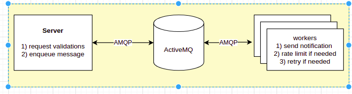

# Notification Service

## Running APP
- run `docker-compose up -d activemq`
- run `docker-compose up server smsworker`

### Note: 
we can add wait script and run `docker-compose up` only but i didn't have time for doing so
[docker-compose-wait](https://github.com/ufoscout/docker-compose-wait)
## Architecture

### ActiveMQ
i use ActiveMQ queues solution. having separate queue per channel (SMS, Email, ....).
i use AMQP protocol which provide a very good ack system also as AMQP is a standard protocol we can easily move to another queuing solution with small code change
#### Why
- support a lot of [protocols](https://activemq.apache.org/protocols)
- open source by the Apache foundation
- ActiveMQ can scale from single to complex, multi-broker architectures
- ActiveMQ is based on Web Console which is a web-based administration tool. External CLI available. (http://localhost:8161/admin/queues.jsp)
- ActiveMQ provide [Delay and Schedule Message Delivery](https://activemq.apache.org/delay-and-schedule-message-delivery) without any plugins
- ActiveMQ provide dead letter queues
#### Note
I recommend to use [AmazonMQ](https://aws.amazon.com/amazon-mq) for production purposes 

## Server
  i implement 
  - error middleware
  - sms create end point with all needed validation
  ### documentation
  you can find api documentation [here](http://localhost:3000/api-docs/)
  ### testing and coverage
  i implement samples for test cases to show how i can implement unit testing (validation) and api testing (health endpoint)

  also i install lib for test coverage 
  you can generate HTML report by using this command 
  `docker-compose exec server yarn run cover`
## Worker
- I choose to have worker per channel which will give us the flexibility to increase replication based on traffic load per channel
- I Implement generic worker function can be reused for other channels we need to just provide queue name and the handle function with right signature
  ### retry
  i implement very simple retry solution 
  so we can retry multiple times before move message to dead litter queue
  ### rate limiter
  i implement very simple rate limiting solution.

  ### note
  i didn't have time to add test cases for worker 
